# Vignette staging analysis: Zapp vs Kira When the Teacher Leaves

Sheet `free_coins_classroom`: 14 beats, 69.08 s, 1 set(s).

**Verdict: PASS**

| Check | Result |
|---|---|
| Beat sheet validation | ok; 11 planned IDs |
| Staging contracts | 0 error(s), 0 warning(s); contracts: move_to x8, remain_still x16, look_at x12, celebrate x3, warning x1, press_button x1, spawn_coin x1, grow_coin x4, confident_pose x1, tip_coin_onto x1, fall_prone x1, reset_button x1 |
| Cameras | 14 recipe, 0 safety fallback, 0 blocked |
| Script coverage | 98.2% (54/55 visual items; threshold 90.0%; 51 audio-only cues not counted) |
| Placeholders | 4 (grey labelled blocks / labelled fallbacks) |

## Sets

| Set | Built from | Origin | Marks | Doors | Notes |
|---|---|---|---|---|---|
| classroom | classroom@1.2.0 | [0, 0, 0] | 29 | classroom_door | - |

## Beats

| Beat | Set | Recipe | Intent | Camera | Min score | Coverage | Missing | Still |
|---|---|---|---|---|---|---|---|---|
| p01 | classroom | establishing_wide | wide | recipe `y-15_s1_h16_f56` | 0.666 | 100.0% (6/6) | - | 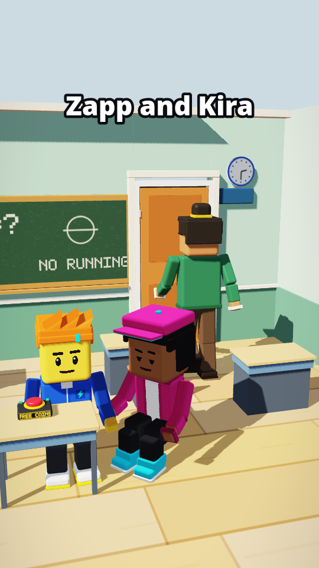 |
| p02 | classroom | establishing_wide | wide | recipe `y-15_s1_h16_f46` | 0.913 | 100.0% (4/4) | - | 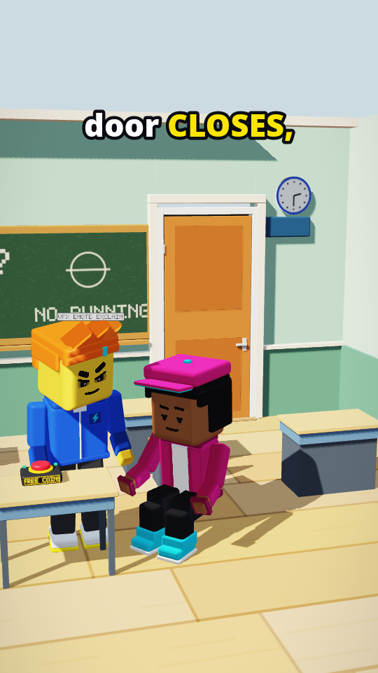 |
| p03 | classroom | low_angle_hero | medium | recipe `y-50_s0.23_h-0.75_f40_n` | 0.969 | 100.0% (2/2) | - | 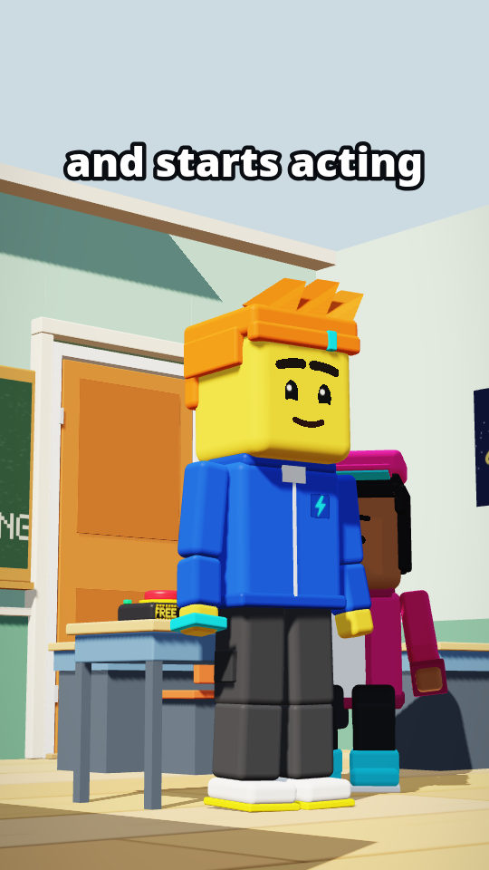 |
| p04 | classroom | two_shot | medium | recipe `y-60_s1_h-0.12_f34` | 0.919 | 100.0% (2/2) | - | 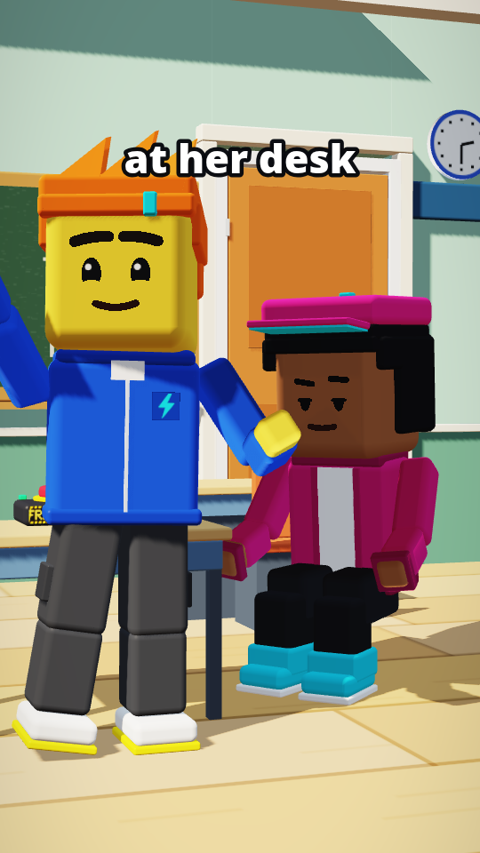 |
| p05 | classroom | insert_prop | prop | recipe `y-45_s0.44_h30_f38` | 0.992 | 100.0% (4/4) | - | 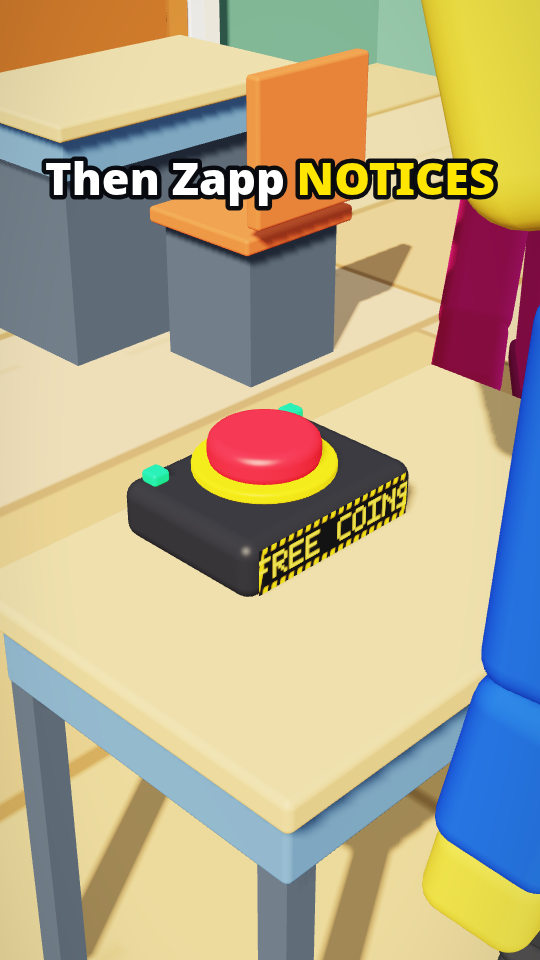 |
| p06 | classroom | two_shot | medium | recipe `aud_y-20_s1_h0.3_f34` | 0.908 | 100.0% (3/3) | - | 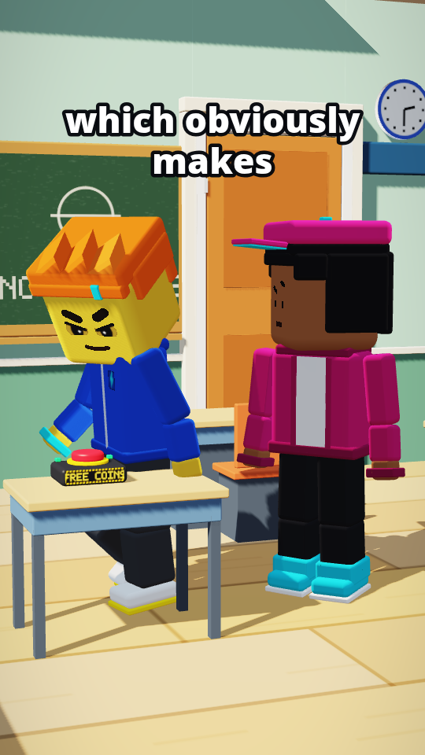 |
| p07 | classroom | wide_environment | wide | recipe `y-15_s1_h12_f44` | 0.850 | 100.0% (5/5) | - | 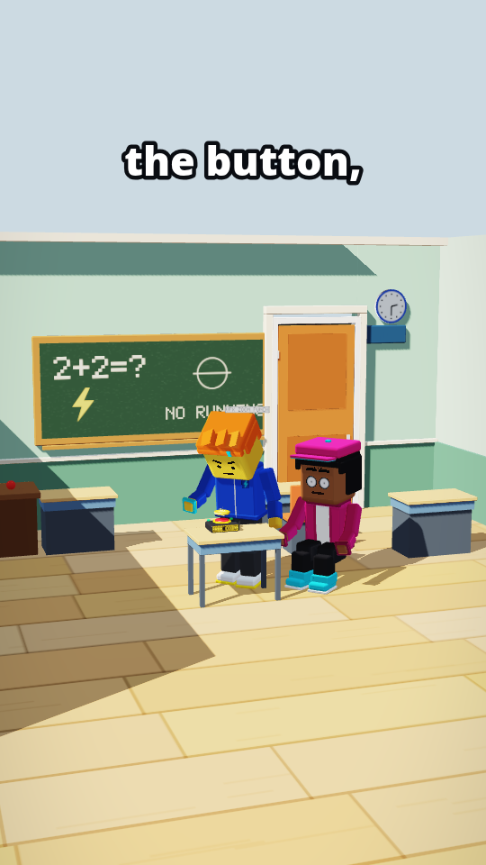 |
| p08 | classroom | medium_single | medium | recipe `y50_s0.22_h-0.08_f38_w` | 0.917 | 80.0% (4/5) | spark_coin (spawned) | 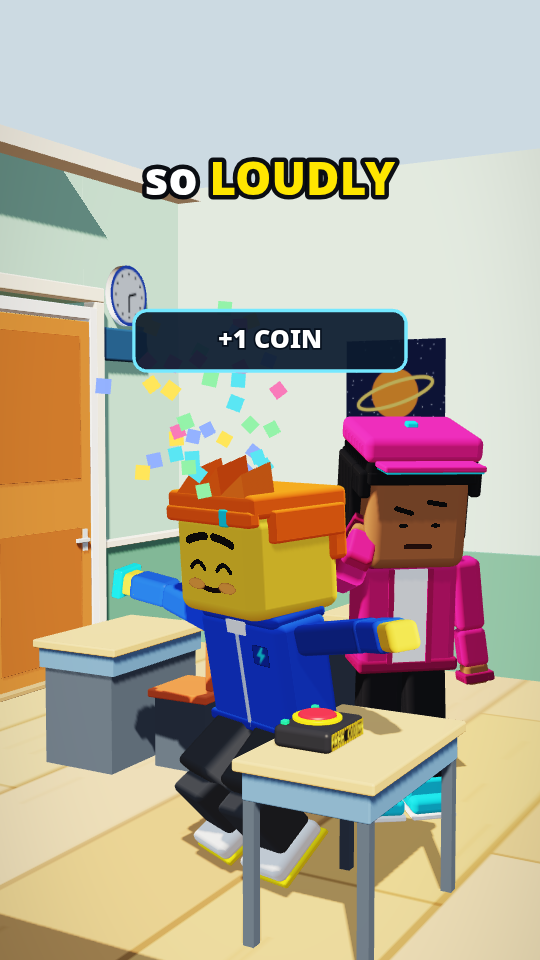 |
| p09 | classroom | wide_environment | wide | recipe `y-15_s1_h12_f44` | 0.850 | 100.0% (4/4) | - | 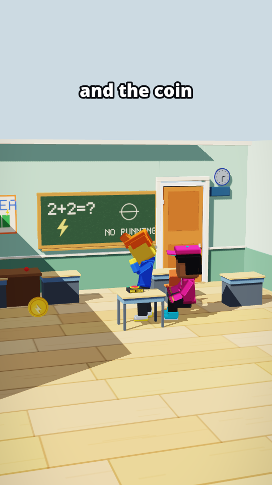 |
| p10 | classroom | wide_environment | wide | recipe `y-15_s1_h12_f44` | 0.850 | 100.0% (4/4) | - | 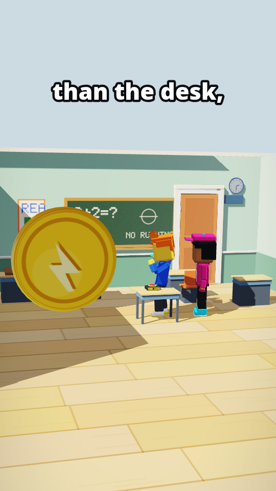 |
| p11 | classroom | wide_environment | wide | recipe `y0_s1_h12_f44` | 0.636 | 100.0% (4/4) | - | 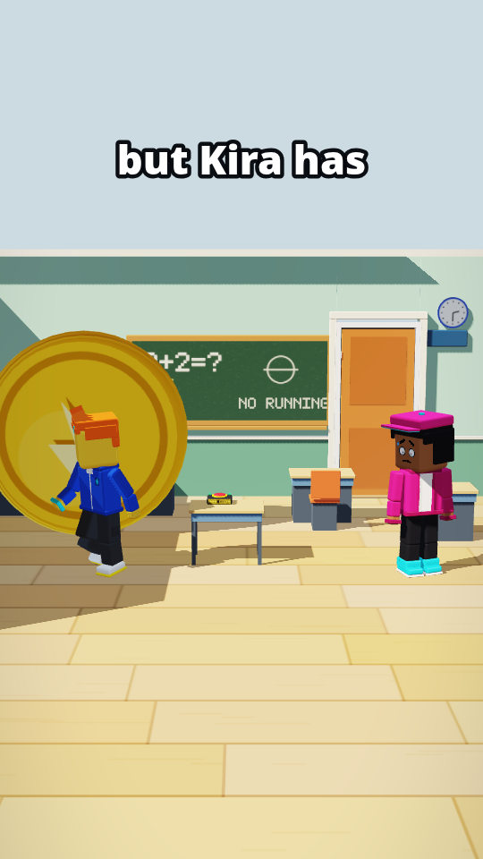 |
| p12 | classroom | wide_environment | wide | recipe `y-15_s1_h12_f52` | 0.810 | 100.0% (4/4) | - | 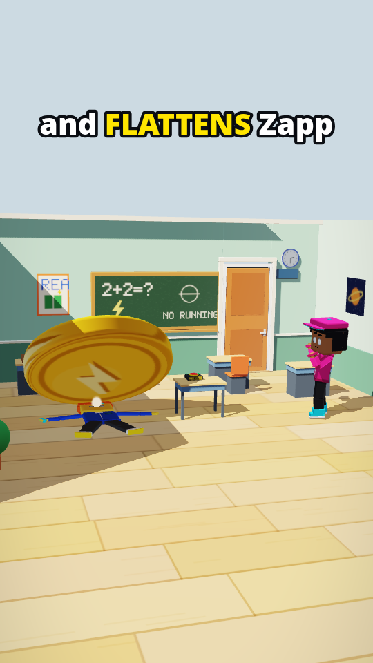 |
| p13 | classroom | wide_environment | wide | recipe `y15_s1_h12_f44` | 0.932 | 100.0% (6/6) | - | 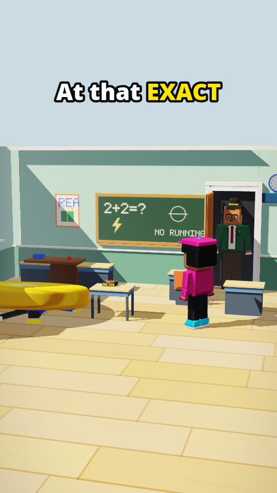 |
| p14 | classroom | final_loop | wide | recipe `ctx_y-15_s1_h10_f46` | 0.850 | 100.0% (2/2) | - | 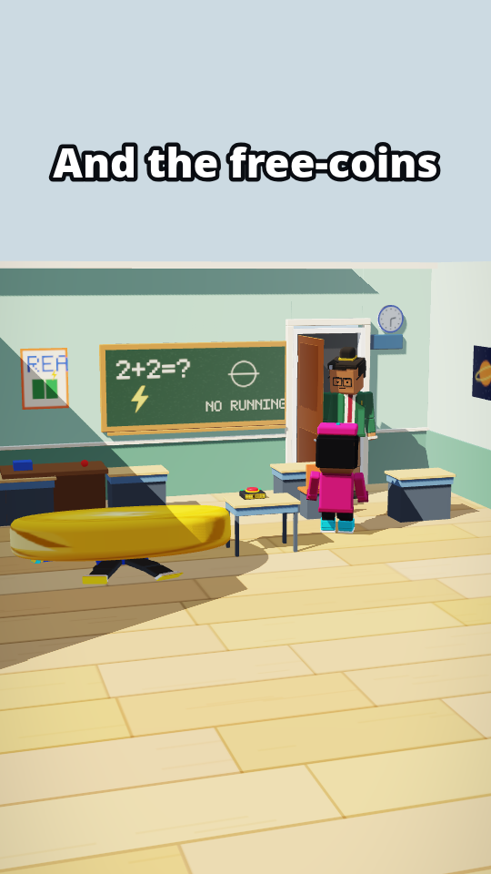 |

## Staging per beat

**p01** (classroom, morning)

- teacher @ exit:classroom_door: walk, face strict, moves 0.11-3.912 s, exits 3.9 s
- zapp @ zapp_desk: sit, face neutral
- kira @ kira_desk: sit, face calm->smug
- prop door @ classroom_door (closed) [2.5, 0, -3.95]
- prop suspicious_button @ button_desk (idle) [-0.1, 0.76, -0.12]

**p02** (classroom, morning)

- zapp @ zapp_desk: look_around, face evil_grin
- kira @ kira_desk: sit, face calm->smug
- prop door @ classroom_door (closed) [2.5, 0, -3.95]
- prop suspicious_button @ button_desk (idle) [-0.1, 0.76, -0.12]

**p03** (classroom, morning)

- zapp @ center_stage: celebrate, face big_grin, moves 9.63-12.578 s
- kira @ kira_desk: sit, face skeptical
- prop door @ classroom_door (closed) [2.5, 0, -3.95]
- prop suspicious_button @ button_desk (idle) [-0.1, 0.76, -0.12]

**p04** (classroom, morning)

- kira @ kira_desk: sit, face smug
- zapp @ center_stage: dance, face happy->curious
- prop door @ classroom_door (closed) [2.5, 0, -3.95]
- prop suspicious_button @ button_desk (idle) [-0.1, 0.76, -0.12]

**p05** (classroom, morning)

- zapp @ center_stage: look_at, face suspicious
- kira @ kira_desk: sit, face skeptical
- prop door @ classroom_door (closed) [2.5, 0, -3.95]
- prop suspicious_button @ button_desk (idle) [-0.1, 0.76, -0.12]

**p06** (classroom, morning)

- kira @ kira_desk: head_shake, face strict->skeptical
- zapp @ press_spot: walk, face evil_grin, moves 25.99-28.971 s
- prop door @ classroom_door (closed) [2.5, 0, -3.95]
- prop suspicious_button @ button_desk (idle) [-0.1, 0.76, -0.12]

**p07** (classroom, morning)

- zapp @ press_spot: press_button, face determined
- kira @ kira_desk: sit, face shock->surprised
- prop door @ classroom_door (closed) [2.5, 0, -3.95]
- prop suspicious_button @ button_desk (pressed) [-0.1, 0.76, -0.12]
- prop spark_coin @ coin_spawn (spawned) [-2.1, 0, -1.4]

**p08** (classroom, morning)

- zapp @ press_spot: celebrate, face laugh
- kira @ kira_desk: facepalm, face skeptical
- prop door @ classroom_door (closed) [2.5, 0, -3.95]
- prop suspicious_button @ button_desk (idle) [-0.1, 0.76, -0.12]
- prop spark_coin @ coin_spawn (spawned) [-2.1, 0, -1.4]

**p09** (classroom, morning)

- zapp @ press_spot: shock_recoil, face shocked
- kira @ kira_desk: sit, face scared
- prop door @ classroom_door (closed) [2.5, 0, -3.95]
- prop suspicious_button @ button_desk (flashing) [-0.1, 0.76, -0.12]
- prop spark_coin @ coin_spawn (growing) [-2.1, 0, -1.4]

**p10** (classroom, morning)

- zapp @ press_spot: shock_recoil, face shocked
- kira @ kira_desk: stand_up, face scared
- prop door @ classroom_door (closed) [2.5, 0, -3.95]
- prop suspicious_button @ button_desk (idle) [-0.1, 0.76, -0.12]
- prop spark_coin @ coin_spawn (giant) [-2.1, 0, -1.4]

**p11** (classroom, morning)

- zapp @ zapp_impact: arms_crossed, face smug->determined, moves 49.91-53.404 s
- kira @ kira_safe: walk, face scared, moves 49.91-52.395 s
- prop door @ classroom_door (closed) [2.5, 0, -3.95]
- prop suspicious_button @ button_desk (idle) [-0.1, 0.76, -0.12]
- prop spark_coin @ coin_spawn (giant) [-2.1, 0, -1.4]

**p12** (classroom, morning)

- zapp @ zapp_impact: flattened, face shocked
- kira @ kira_safe: shock_recoil, face shock->surprised
- prop door @ classroom_door (closed) [2.5, 0, -3.95]
- prop suspicious_button @ button_desk (idle) [-0.1, 0.76, -0.12]
- prop spark_coin @ giant_front (tipped) [-2, 0, -0.75]

**p13** (classroom, morning)

- teacher @ enter:classroom_door: walk, face strict, moves 60.6-62.064 s, enters 60.6 s
- kira @ kira_desk: sit, face calm->smug, moves 59.91-61.993 s
- zapp @ zapp_impact: flattened, face regret
- prop door @ classroom_door (open) [2.5, 0, -3.95]
- prop suspicious_button @ button_desk (idle) [-0.1, 0.76, -0.12]
- prop spark_coin @ giant_front (tipped) [-2, 0, -0.75]

**p14** (classroom, morning)

- teacher @ classroom_door_inside: look_at, face strict
- kira @ kira_desk: sit, face smug
- zapp @ zapp_impact: flattened, face regret
- prop door @ classroom_door (open) [2.5, 0, -3.95]
- prop suspicious_button @ button_desk (reset) [-0.1, 0.76, -0.12]
- prop spark_coin @ giant_front (tipped) [-2, 0, -0.75]

## Staging issues

None.

## Placeholders and fallbacks

| Kind | ID | Status | Rendered as |
|---|---|---|---|
| music | amb_classroom | available | assets/audio/amb_classroom@1.0.0.json |
| music | bed_upbeat | planned | planned (S7); not drawn |
| music | bed_suspense | planned | planned (S7); not drawn |
| music | bed_silly | planned | planned (S7); not drawn |
| sfx | footsteps | planned | planned (S7); not drawn |
| sfx | door_open | planned | planned (S7); not drawn |
| sfx | door_slam | planned | planned (S7); not drawn |
| vfx | emote_exclaim | planned | planned (S7); labelled placeholder |
| sfx | whoosh | planned | planned (S7); not drawn |
| sfx | sfx_tada | available | assets/audio/sfx_tada@1.0.0.json |
| sfx | sfx_beep | available | assets/audio/sfx_beep@1.0.0.json |
| sfx | sfx_blip_question | available | assets/audio/sfx_blip_question@1.0.0.json |
| sfx | sfx_click | available | assets/audio/sfx_click@1.0.0.json |
| vfx | zoom_punch | planned | planned (S7); labelled placeholder |
| sfx | sfx_coin_pop | available | assets/audio/sfx_coin_pop@1.0.0.json |
| sfx | sfx_boing | available | assets/audio/sfx_boing@1.0.0.json |
| sfx | sfx_rumble | available | assets/audio/sfx_rumble@1.0.0.json |
| vfx | emote_sweat | planned | planned (S7); labelled placeholder |
| sfx | sfx_creak | available | assets/audio/sfx_creak@1.0.0.json |
| sfx | sfx_thud_big | available | assets/audio/sfx_thud_big@1.0.0.json |
| vfx | emote_question | planned | planned (S7); labelled placeholder |
| sfx | sfx_ding_reset | available | assets/audio/sfx_ding_reset@1.0.0.json |
| expression_fallback | kira | p01 | kira: kira has no "calm" face; nearest drawable "smug" |
| expression_fallback | kira | p02 | kira: kira has no "calm" face; nearest drawable "smug" |
| look_at_camera | zapp | p03 | zapp looks at the camera: body turned to the audience side (the engine has no camera look target) |
| expression_fallback | zapp | p04 | zapp: zapp has no "happy" face; nearest drawable "curious" |
| expression_fallback | kira | p06 | kira: kira has no "strict" face; nearest drawable "skeptical" |
| expression_fallback | kira | p07 | kira: kira has no "shock" face; nearest drawable "surprised" |
| expression_fallback | zapp | p11 | zapp: zapp has no "smug" face; nearest drawable "determined" |
| look_at_camera | zapp | p11 | zapp looks at the camera: body turned to the audience side (the engine has no camera look target) |
| expression_fallback | kira | p12 | kira: kira has no "shock" face; nearest drawable "surprised" |
| expression_fallback | kira | p13 | kira: kira has no "calm" face; nearest drawable "smug" |
| look_at_camera | kira | p14 | kira looks at the camera: body turned to the audience side (the engine has no camera look target) |

## Coverage misses

| Beat | Item | Seen / samples | Note |
|---|---|---|---|
| p08 | prop: spark_coin (spawned) | 0/14 |  |
