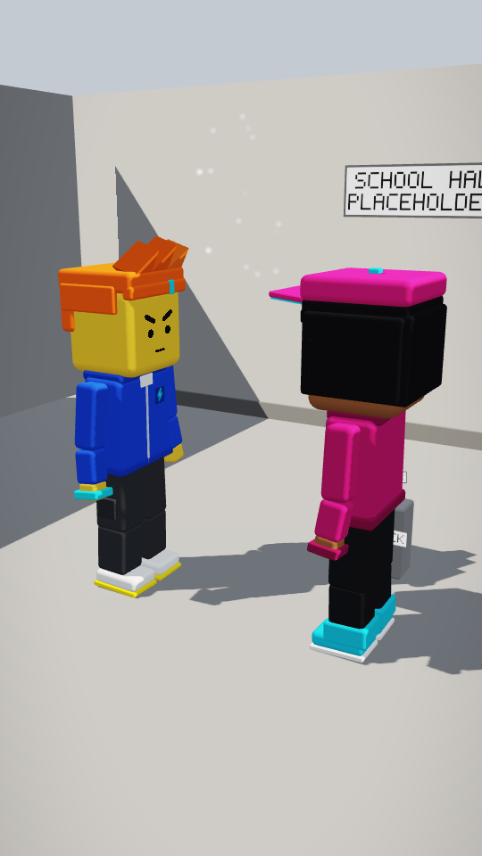
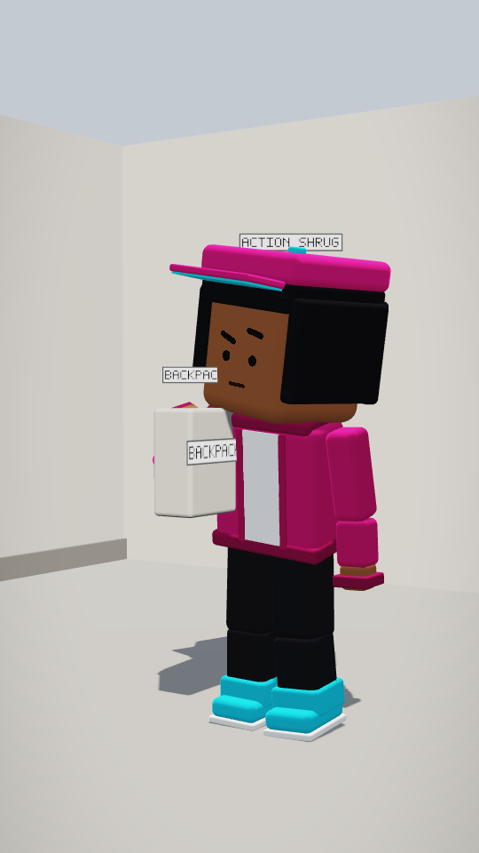
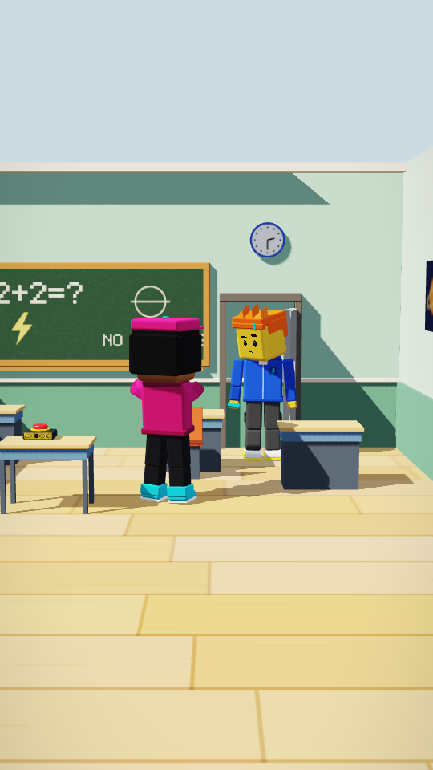
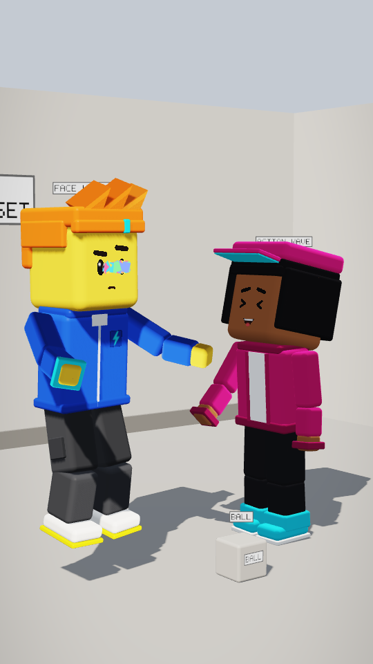

# Vignette staging analysis: Multi-set staging demo: hallway -> classroom -> playground

Sheet `multi_set_demo`: 4 beats, 16.00 s, 3 set(s).

**Verdict: BLOCKED** (camera safety blocked 1 beat(s): p02; script coverage 80.0% < 90%)

| Check | Result |
|---|---|
| Beat sheet validation | ok; 12 planned IDs |
| Staging contracts | 0 error(s), 0 warning(s); contracts: look_at x6, remain_still x2, move_to x2, confident_pose x1, jump x1 |
| Cameras | 3 recipe, 0 safety fallback, 1 blocked |
| Script coverage | 80.0% (16/20 visual items; threshold 90.0%; 3 audio-only cues not counted) |
| Placeholders | 9 (grey labelled blocks / labelled fallbacks) |

## Sets

| Set | Built from | Origin | Marks | Doors | Notes |
|---|---|---|---|---|---|
| school_hallway | grey placeholder room | [0, 0, 0] | 2 | hall_door | placeholder set: 2 marks and 1 doors allocated from the beats (planned (S2)) |
| classroom | classroom@1.1.0 | [40, 0, 0] | 27 | classroom_door | - |
| playground | grey placeholder room | [80, 0, 0] | 3 | - | placeholder set: 3 marks and 0 doors allocated from the beats (planned (S2)) |

## Beats

| Beat | Set | Recipe | Intent | Camera | Min score | Coverage | Missing | Still |
|---|---|---|---|---|---|---|---|---|
| p01 | school_hallway | establishing_wide | wide | recipe `y30_s1_h16_f56` | 0.951 | 100.0% (4/4) | - |  |
| p02 | school_hallway | medium_single | medium | **BLOCKED** (HEAD_CROPPED, PROP_COVERS_FACE) | 0.919 | 40.0% (2/5) | zapp (run), door_open hall_door@5, exit zapp hall_door@7 |  |
| p03 | classroom | wide_environment | wide | recipe `y0_s1_h6_f44` | 0.936 | 85.7% (6/7) | door (closed) |  |
| p04 | playground | two_shot | medium | recipe `aud_y-40_s1_h0.3_f34` | 0.990 | 100.0% (4/4) | - |  |

## Staging per beat

**p01** (school_hallway, day)

- zapp @ hall_center: walk (played as move_to/idle), face determined
- kira @ lockers: idle, face smug
- prop backpack @ kira (closed) [0, 0, 0]

**p02** (school_hallway, day)

- zapp @ exit:hall_door: run (played as move_to/idle), face happy->curious, moves 4.078-7 s, exits 7 s — label: FACE happy
- kira @ lockers: shrug (played as look_at/curious_lean), face skeptical — label: ACTION shrug
- prop backpack @ kira (closed) [0, 0, 0]

**p03** (classroom, morning)

- zapp @ enter:classroom_door: walk (played as move_to/idle), face curious, moves 8.6-10.064 s, enters 8.6 s
- kira @ kira_desk: arms_crossed, face smug
- prop door @ classroom_door (closed) [42.5, 0, -3.95]
- prop suspicious_button @ button_desk (idle) [39.9, 0.76, -0.12]

**p04** (playground, day)

- zapp @ slide: jump, face happy->curious — label: FACE happy
- kira @ swings: wave (played as look_at/point), face laughing — label: ACTION wave
- prop ball @ sandpit (idle) [80, 0, 0.6]

## Staging issues

None.

## Placeholders and fallbacks

| Kind | ID | Status | Rendered as |
|---|---|---|---|
| sets | school_hallway | planned | grey placeholder room |
| sets | playground | planned | grey placeholder room |
| props | backpack | planned | grey placeholder block (planned (S4)) |
| props | door | planned | grey placeholder block (planned (S4)) |
| props | ball | planned | grey placeholder block (planned (S4)) |
| music | bed_upbeat | planned | planned (S7); not drawn |
| sfx | bell | planned | planned (S7); not drawn |
| sfx | door_open | planned | planned (S7); not drawn |
| sfx | sfx_tada | available | assets/audio/sfx_tada@1.0.0.json |
| set_placeholder | - | null | school_hallway: placeholder set: 2 marks and 1 doors allocated from the beats (planned (S2)) |
| set_placeholder | - | null | playground: placeholder set: 3 marks and 0 doors allocated from the beats (planned (S2)) |
| prop_state_placeholder | backpack | p01 | backpack (placeholder block) state "closed" is shown on its label only |
| expression_fallback | zapp | p02 | zapp: zapp has no "happy" face; nearest drawable "curious" |
| action_placeholder | kira | p02 | kira: planned action (S5); played as look_at/curious_lean |
| prop_state_placeholder | backpack | p02 | backpack (placeholder block) state "closed" is shown on its label only |
| expression_fallback | zapp | p04 | zapp: zapp has no "happy" face; nearest drawable "curious" |
| action_placeholder | kira | p04 | kira: planned action (S5); played as look_at/point |
| prop_state_placeholder | ball | p04 | ball (placeholder block) state "idle" is shown on its label only |
| look_at_camera | zapp | p04 | zapp looks at the camera: body turned to the audience side (the engine has no camera look target) |

## Coverage misses

| Beat | Item | Seen / samples | Note |
|---|---|---|---|
| p02 | cast: zapp (run) | 3/9 |  |
| p02 | event: door_open hall_door@5 | 0/3 |  |
| p02 | event: exit zapp hall_door@7 | 0/3 |  |
| p03 | prop: door (closed) | 4/12 |  |
